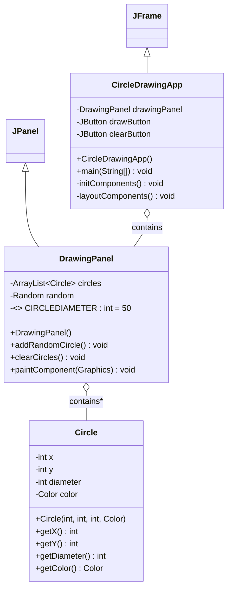

# GUI in java

## Description
This project demonstrates a Java Swing GUI application that allows users to draw colorful circles on a panel. The application uses buttons for user interaction and applies event handling and custom drawing. It is designed to help understand GUI programming and basic graphics in Java.

## Objectives
- To understand Java Swing GUI components
- To learn event handling using buttons
- To practice drawing graphics in Java
- To apply object-oriented programming concepts

## Concepts Demonstrated
- **GUI Development**: JFrame, JPanel, JButton
- **Event Handling**: ActionListener for button clicks
- **Custom Drawing**: Drawing circles using Graphics
- **Randomization**: Random color and position generation
- **Object-Oriented Programming**: Class-based design

## Class Design (UML Diagram)

## Features
- Draw random circles using a button
- Clear all circles using a clear button
- Random colors and positions for each circle
- Simple and easy-to-use interface

## How It Works
1. The application starts using a JFrame
2. Clicking **Draw Circle** creates a new random circle
3. Circles are drawn on the panel using the Graphics class
4. Clicking **Clear** removes all circles from the panel
5. The panel updates automatically after each action

## Sample Output Behavior
- Circles appear when the draw button is clicked
- Each circle has a different color and position
- All circles disappear when the clear button is pressed

## Learning Outcome
- Clear understanding of Java Swing basics
- Better knowledge of event-driven programming
- Experience with custom graphics drawing
- Improved GUI application development skills

## Conclusion
This project successfully demonstrates how Java Swing can be used to build an interactive graphical application. It shows the effective use of buttons, event handling, and custom drawing to create a simple circle drawing program.

## Author Details
**Name**: Antor Chandra Bhowmick  
**ID**: 242002111  
**University**: Green University of Bangladesh  
**Program**: B.Sc. in Computer Science and Engineering  
**Purpose**: Lab Submission

---

⭐ *This project was created as part of an academic lab assignment to practice Java Swing, event handling, and custom graphics.*
